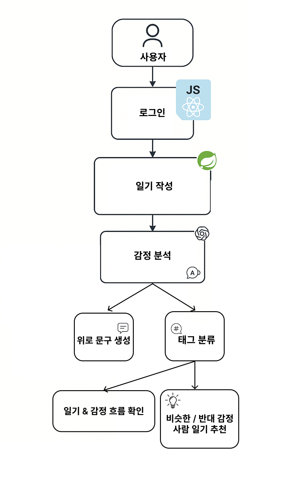
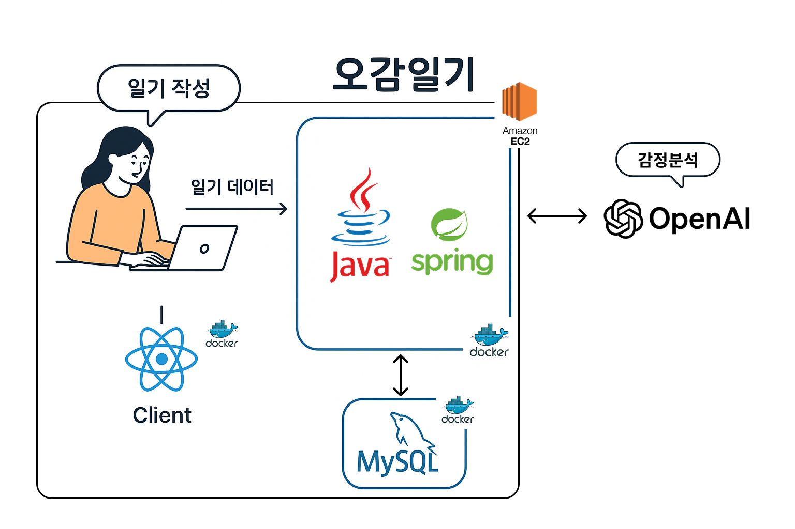

## 🌿 오감일기 | 감정 기반 AI 일기 서비스

## 목차

- [ 개요 ](#개요)
- [ 기술스택 ](#🚀기술스택)
- [ 서비스 소개 ](#✍서비스_소개)
- [ 기능 소개 ](#💬기능_소개)
- [ 향후 계획 ](#💭향후계획)
- [ 산출물 ](#📜산출물)
- [ 멤버 소개 ](#👪멤버소개)

---

## 개요

- Kernel360 해커톤 프로젝트
- 팀명 : 오감일기
- 진행 기간: 2025.05.07~2025.05.09

 

## 🚀기술스택

 

---

## ✍서비스\_소개

**오감일기**는 감정을 기록하고 공유하며,  
나와 닮은 누군가와 연결되는 감성 기반 AI 일기 서비스입니다.

하루를 짧게 적는 것만으로도,  
AI가 당신의 감정을 이해하고 위로하며,  
공감할 수 있는 사람과 이어줍니다.

> “오늘 하루, 당신은 어떤 감정을 느끼셨나요?”  
> 감정을 기록하는 것에서 끝나지 않고,  
> **공감과 위로, 연결이 시작되는 곳 — 오감일기.**

## 💬기능\_소개

### 1️⃣ 하루 한 줄, 감정 일기 작성

- 하루에 한 편, 50자 이내의 짧은 일기를 작성합니다.
- 간단하지만 진솔한 감정 기록으로 하루를 정리할 수 있습니다.

### 2️⃣ 감정 태그 자동 생성 (AI 기반)

- AI가 일기에서 감정을 분석해 **주 감정 1개, 부 감정 여러 개**를 자동 태그로 생성합니다.
- 예: `#기쁨`, `#불안`, `#피곤함`

### 3️⃣ 감정 기반 위로 문장 생성

- 감정 분석 결과를 바탕으로 AI가 **맞춤형 위로 문장**을 제공합니다.
- 예: `"지금 충분히 잘하고 있어요. 무리하지 않아도 괜찮아요."`

### 4️⃣ 비슷한 감정의 사람 일기 추천

- 감정 태그를 기반으로, 비슷한 감정을 가진 사람의 일기를 추천합니다.
- “오늘 나와 비슷한 감정을 가진 사람은 어떤 하루를 보냈을까?”
- 감정으로 연결되는 **공감 커뮤니티** 경험 제공.

### 5️⃣ 감정 흐름 시각화

- 내가 쓴 일기들을 분석해 감정의 흐름을 꺾은선 그래프로 시각화합니다.
- 나의 감정 변화와 흐름을 한눈에 확인할 수 있습니다.

## 💭향후계획

- 감정 태그 직접 선택 및 편집 기능 추가
- 감정 기반 친구 맺기 / 알림 기능
- 더 정교한 감정 분석 모델 도입 (다중 감정 인식)

> 📖 하루의 감정을 기록하는 것만으로,  
> 우리는 서로를 이해할 수 있습니다.

**지금, 오감일기로 당신의 하루를 기록해보세요.**

 

---

## 📜산출물

### 플로우차트

### 서비스 아키텍처

 

## 👪멤버소개

<table>
<tr align="center">
   <th>강예주</th>
   <th>문혜영</th>
   <th>상우진</th>
   <th>이수하</th>
   <th>이혜린</th>
</tr>
<tr align ="center">  
   <td></td>
   <td></td>
   <td></td>
   <td></td>
   <td> </td>

</tr>
<tr align ="center">
    <td>Full-stack</td>
    <td>Back</td>
   <td>Back</td>
    <td>Back</td>
    <td>Back</td>
</tr>
</table>

